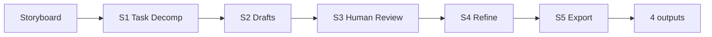
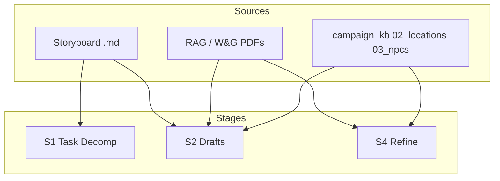
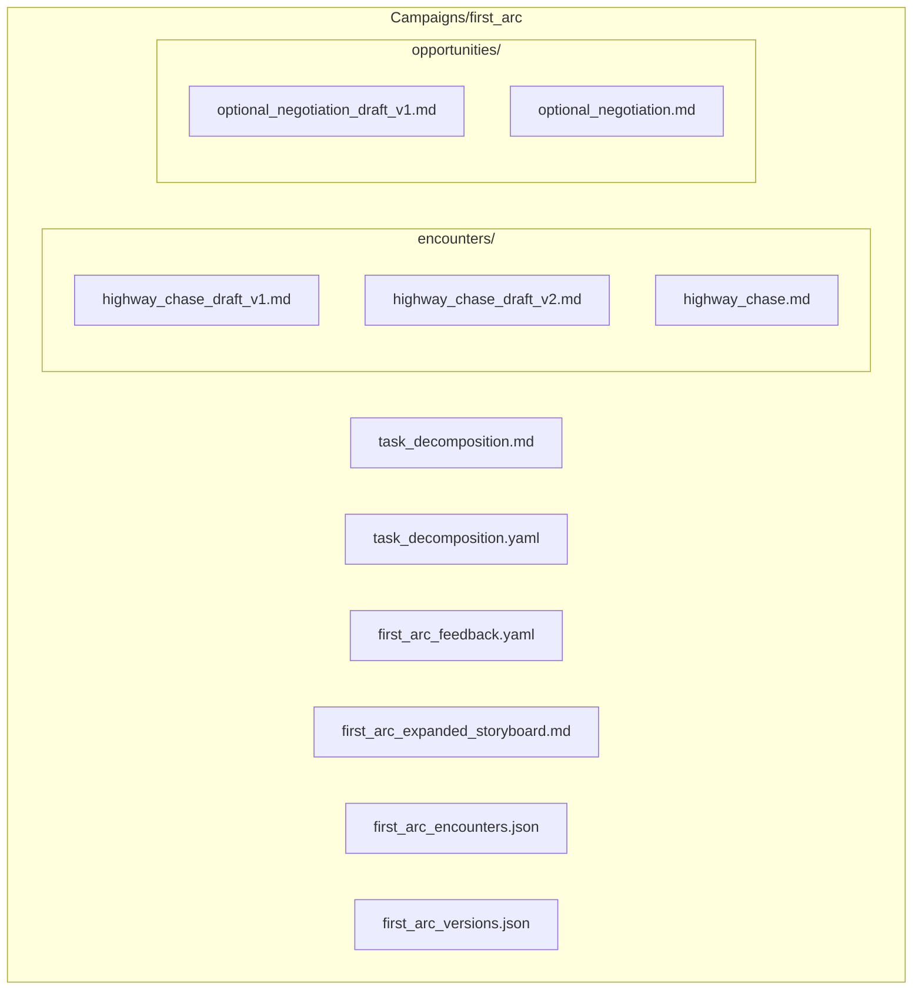

# Workflow Diagrams

Pipeline, data flow, and file layout for the Storyboard-to-Encounter workflow. Source of truth for docs and future GUI.

## Pipeline Flowchart



- **S1:** Storyboard → task_decomposition.md / .yaml
- **S2:** Task decomposition + storyboard → encounters/*_draft_v1.md, opportunities/*_draft_v1.md
- **S3:** Human-only; produces structured feedback (YAML/JSON)
- **S4:** Draft + feedback → next *_draft_vN.md
- **S5:** All refined encounters → hierarchical MD, expanded storyboard, JSON, 04_missions_*_encounters.md

## Data Flow

RAG, campaign_kb, and storyboard feed stages as follows:



- **S1** uses only the storyboard.
- **S2** uses storyboard, task decomposition, RAG (mechanics), and campaign_kb (NPCs, locations).
- **S4** uses draft, feedback, RAG, and campaign_kb when applying feedback.

## File Layout (Arc Tree)

Layout for `Campaigns/{arc_id}/` (example: `first_arc`):

```
Campaigns/
  first_arc/
    task_decomposition.md
    task_decomposition.yaml
    first_arc_feedback.yaml
    first_arc_expanded_storyboard.md
    first_arc_encounters.json
    first_arc_versions.json
    encounters/
      highway_chase_draft_v1.md
      highway_chase_draft_v2.md
      highway_chase.md
    opportunities/
      optional_negotiation_draft_v1.md
      optional_negotiation.md
```

Mermaid-style block diagram of the same layout:


