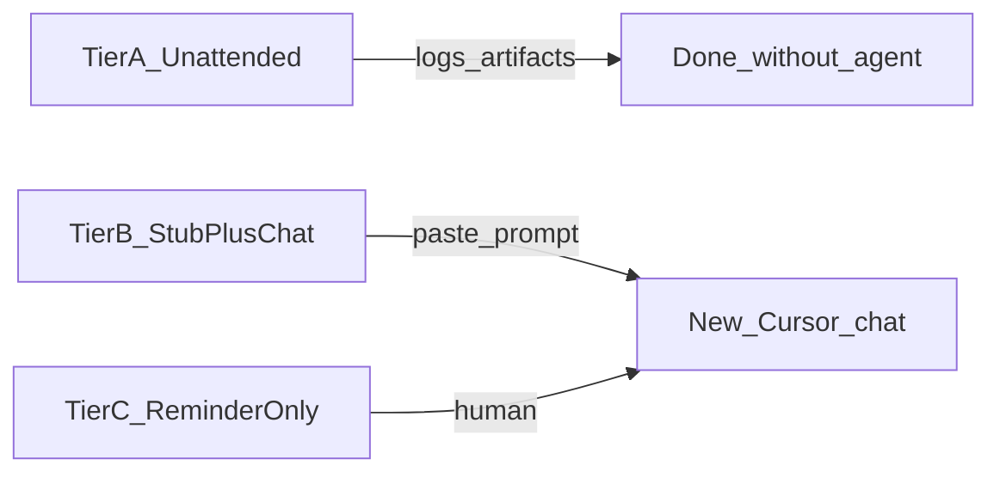

# Scheduled tasks (MiscRepos + local-proto)

Single source of truth for **what to run on a schedule**, **where logs go**, and **how to wire the OS or GitHub**. Cursor agents are **not** started by these jobs; see [.cursor/docs/GOVERNANCE_RITUAL.md](../../.cursor/docs/GOVERNANCE_RITUAL.md) for the same rule on governance. **Multi-repo weekly digest** (below) is a separate optional Task Scheduler entry from **`Harness-GovernanceRuns`** (governance stub only).

### What “scheduled” means (automation tiers)

Scripts and OS jobs differ in how much work finishes without a **new Cursor chat**. Use these tiers so the SSOT does not imply full automation where the design is human-in-the-loop (HITL).

| Tier | Meaning | Examples in this harness |
|------|---------|---------------------------|
| **A — Unattended** | Script runs to completion; success is exit 0 + artifacts; **no** agent chat required. | `pytest` phase of `scheduled_code_review.ps1`, `scheduled_perf_context_bundle.ps1`, `report_outdated_dependencies.ps1`, `sync_harness_to_vault.ps1` when env is set. |
| **B — Stub / HITL** | Script runs on a timer and exits, but **intent** is logs + **pasteable prompt**; narrative or analysis happens in a **new chat**. | `scheduled_governance.ps1`, `run_weekly_review.ps1`, `run_meta_review.ps1` (output you paste). |
| **C — Reminder only** | Calendar or checklist discipline; **no** harness script must run. | “Run continual learning after ~N handoffs,” optional ritual steps you do without a scheduled script. |



**Hygiene (not calendar jobs here):** Validators such as `validate_pending_tasks_table.py`, `split_done_tasks_to_completed.py`, or `audit_pending_credentials.py` are usually **pre-commit / CI or ad hoc** — Tier A when run as scripts, Tier C when “remember quarterly.” Do not list them as Sunday 9am Task Scheduler jobs unless you deliberately add one. **Exception:** register **`Harness-PendingTasksArchive`** (weekly) if you want `done` rows moved from `pending_tasks.md` to `completed_tasks.md` on a timer — see [§ Harness-PendingTasksArchive](#harness-pendingtasksarchive-cli-optional) below.

## Scripts (run from repo root unless noted)

| Job | Script | Tier | Purpose | Default log location |
|-----|--------|------|---------|----------------------|
| Weekly governance | `.cursor/scripts/scheduled_governance.ps1` | B | Meta-review + GUI wave prompts (paste blocks from log) | `.cursor/state/governance_runs/` |
| Code review (periodic) | `.cursor/scripts/scheduled_code_review.ps1` | A + B | `pytest local-proto/tests` (A) + meta-review prompt log (B) | `.cursor/state/code_review_runs/` |
| Context / token baseline | `local-proto/scripts/scheduled_perf_context_bundle.ps1` | A | Runs [measure_context_bundle.py](../scripts/measure_context_bundle.py) | `.cursor/state/perf_bundle_runs/` |
| Dependency report (local) | `local-proto/scripts/report_outdated_dependencies.ps1` | A | `pip list --outdated` (no upgrades) | `local-proto/logs/dependency_reports/` |
| Vault / harness mirror | `local-proto/scripts/sync_harness_to_vault.ps1` | A | Copy handoff, pending_tasks, key docs into Obsidian **Harness/** (requires `OBSIDIAN_VAULT_ROOT`; respects `VAULT_SYNC_SAFE_BASE`). Suggested cadence: **weekly** or **after handoff**. | Vault paths under `Harness/`; see [OBSIDIAN_VAULT_INTEGRATION.md](../../.cursor/docs/OBSIDIAN_VAULT_INTEGRATION.md) |
| OpenGrimoire → vault export | `python local-proto/scripts/export_opengrimoire_to_vault.py` | A | Health-check OG (`GET /api/capabilities`), optional `OPENGRIMOIRE_EXPORT_JSON` → immutable `Interview-Archive/OG-Snapshot-*.md`, `REVOKED-*.md`, refresh `.cursor/state/og_intent_excerpt.md`. Requires `OBSIDIAN_VAULT_ROOT`, `OPENGRIMOIRE_BASE_URL`, secrets in env. **Human-gate** before agents run with prod tokens. | Console; see [docs/agent/INTENT_ELICITATION_AND_OG.md](../../docs/agent/INTENT_ELICITATION_AND_OG.md) |
| Vault resync (guarded) | `local-proto/scripts/int-vault-resync.ps1` | A | Fingerprint + trigger-aware wrapper around `sync_harness_to_vault.ps1` (handoff / git hook / scheduler). | `.cursor/state/int_vault_resync.log`, `int_vault_resync.json`; see [OBSIDIAN_VAULT_INTEGRATION.md](../../.cursor/docs/OBSIDIAN_VAULT_INTEGRATION.md#int-vault-resync) |
| Pending→completed archive | `.cursor/scripts/scheduled_split_done_tasks.ps1` | A | Runs `validate_pending_tasks_table.py`, optional `split_done_tasks_to_completed.py --dry-run` log, then archives **Status == done** rows to `completed_tasks.md`. Default passes `--ignore-vault-resync-failure` so exit 0 if split succeeded but vault env failed; use `-StrictVault` or `-SkipVaultResync` to change behavior. **Git:** script does not commit; commit `pending_tasks.md` / `completed_tasks.md` when ready. | `.cursor/state/pending_tasks_archive_runs/YYYY-MM-DD_split.log` |
| Multi-repo weekly digest | `.cursor/scripts/run_weekly_review.ps1` | B | Runs `collect_weekly_digest.ps1`, optional Obsidian copy, **pasteable** weekly narrative prompt. Registry + flags: [.cursor/docs/WEEKLY_MULTI_REPO_REVIEW.md](../../.cursor/docs/WEEKLY_MULTI_REPO_REVIEW.md). Optional `-AppendToGovernanceLog` for one line in today’s governance log. | `.cursor/state/weekly_digest/weekly_digest_YYYY-MM-DD.{json,md}` |

### Optional / manual unless scheduled

These scripts are **not** registered on the host by default. Add Task Scheduler, cron, or launchd if you want a fixed cadence; otherwise run ad hoc.

| Job | Script | Tier | Purpose | Default log location |
|-----|--------|------|---------|----------------------|
| Daily ops | `local-proto/scripts/daily_ops.ps1` | A | Precheck, MCP warmup, tiered smoke, optional OpenHarness bundle verify | Console; see [OPS_BOOTSTRAP_OPEN_GRIMOIRE.md](OPS_BOOTSTRAP_OPEN_GRIMOIRE.md) |

### PowerShell examples

Use **`-WindowStyle Hidden -NonInteractive`** when a human is not watching the console (e.g. Task Scheduler); omit for interactive debugging.

```powershell
# Code review (tests + meta-review log)
powershell -NoProfile -WindowStyle Hidden -NonInteractive -ExecutionPolicy Bypass -File .cursor/scripts/scheduled_code_review.ps1

# Code review when governance already emits weekly meta-review (pytest + log only)
powershell -NoProfile -WindowStyle Hidden -NonInteractive -ExecutionPolicy Bypass -File .cursor/scripts/scheduled_code_review.ps1 -RepoRoot "C:\path\to\MiscRepos" -SkipMetaReviewPrompt

# Token bundle (add -OrchestratorEstimate for orchestrator chat estimate)
powershell -NoProfile -WindowStyle Hidden -NonInteractive -ExecutionPolicy Bypass -File local-proto/scripts/scheduled_perf_context_bundle.ps1

# Outdated packages report only
powershell -NoProfile -WindowStyle Hidden -NonInteractive -ExecutionPolicy Bypass -File local-proto/scripts/report_outdated_dependencies.ps1

# Vault mirror (requires OBSIDIAN_VAULT_ROOT in environment or session)
powershell -NoProfile -WindowStyle Hidden -NonInteractive -ExecutionPolicy Bypass -File local-proto/scripts/sync_harness_to_vault.ps1

# OpenGrimoire export bridge (after OG interview / async updates; set OPENGRIMOIRE_* env)
python local-proto/scripts/export_opengrimoire_to_vault.py

# Multi-repo weekly digest (Tier B: paste printed prompt into a new chat). Optional -RepoRoot if discovery fails.
powershell -NoProfile -WindowStyle Hidden -NonInteractive -ExecutionPolicy Bypass -File .cursor/scripts/run_weekly_review.ps1 -RepoRoot "C:\path\to\MiscRepos"

# Pending→completed task archive (Tier A; see § Harness-PendingTasksArchive)
powershell -NoProfile -WindowStyle Hidden -NonInteractive -ExecutionPolicy Bypass -File .cursor/scripts/scheduled_split_done_tasks.ps1 -RepoRoot "C:\path\to\MiscRepos"
```

### Cron (Linux/macOS) examples

Use the machine’s local timezone or UTC consistently.

| Intent | Cron | Command |
|--------|------|---------|
| Code review weekly (recommended) | `0 18 * * 2` | `cd /path/to/MiscRepos && powershell -WindowStyle Hidden -NoProfile -NonInteractive -ExecutionPolicy Bypass -File .cursor/scripts/scheduled_code_review.ps1 -RepoRoot /path/to/MiscRepos -SkipMetaReviewPrompt` |
| Code review twice daily (high churn) | `0 12,20 * * *` | `cd /path/to/MiscRepos && powershell -WindowStyle Hidden -NoProfile -NonInteractive -ExecutionPolicy Bypass -File .cursor/scripts/scheduled_code_review.ps1 -RepoRoot /path/to/MiscRepos -SkipMetaReviewPrompt` (omit `-SkipMetaReviewPrompt` only if governance does not emit meta-review on overlapping days) |
| Weekly governance (Monday 09:00) | `0 9 * * 1` | `cd /path/to/MiscRepos && /usr/bin/pwsh -NoProfile -WindowStyle Hidden -NonInteractive -ExecutionPolicy Bypass -File .cursor/scripts/scheduled_governance.ps1 -RepoRoot /path/to/MiscRepos` |
| Weekly multi-repo digest (Tier B; align with governance day if desired) | `30 9 * * 1` | `cd /path/to/MiscRepos && /usr/bin/pwsh -NoProfile -WindowStyle Hidden -NonInteractive -ExecutionPolicy Bypass -File .cursor/scripts/run_weekly_review.ps1 -RepoRoot /path/to/MiscRepos` (optional `-AppendToGovernanceLog`; registry per [WEEKLY_MULTI_REPO_REVIEW.md](../../.cursor/docs/WEEKLY_MULTI_REPO_REVIEW.md)) |
| Token bundle daily (recommended) | `0 7 * * *` | `cd /path/to/MiscRepos && powershell -WindowStyle Hidden -NoProfile -NonInteractive -ExecutionPolicy Bypass -File local-proto/scripts/scheduled_perf_context_bundle.ps1 -Quiet` |
| Token bundle hourly (high churn) | `0 * * * *` | `cd /path/to/MiscRepos && powershell -WindowStyle Hidden -NoProfile -NonInteractive -ExecutionPolicy Bypass -File local-proto/scripts/scheduled_perf_context_bundle.ps1 -Quiet` |
| Weekly outdated report (Sunday 10:00) | `0 10 * * 0` | `cd /path/to/MiscRepos && powershell -WindowStyle Hidden -NoProfile -NonInteractive -ExecutionPolicy Bypass -File local-proto/scripts/report_outdated_dependencies.ps1` |
| Vault mirror (weekly example) | `0 10 * * 0` | `cd /path/to/MiscRepos && powershell -WindowStyle Hidden -NoProfile -NonInteractive -ExecutionPolicy Bypass -File local-proto/scripts/sync_harness_to_vault.ps1 -HarnessRoot /path/to/MiscRepos` (set `OBSIDIAN_VAULT_ROOT` in crontab env or wrapper) |
| Pending→completed archive (weekly) | `40 10 * * 0` | `cd /path/to/MiscRepos && powershell -WindowStyle Hidden -NoProfile -NonInteractive -ExecutionPolicy Bypass -File .cursor/scripts/scheduled_split_done_tasks.ps1 -RepoRoot /path/to/MiscRepos` |

**Note:** `*/1 * * * *` runs **every minute**, not hourly. For hourly use `0 * * * *`.

### Windows Task Scheduler

Canonical click-by-click steps for recurring tasks: [.cursor/docs/GOVERNANCE_RITUAL.md](../../.cursor/docs/GOVERNANCE_RITUAL.md) (Scheduled task section). Create one task per script or combine triggers when you want multiple run times.

#### Operator comfort (cadence + console flash)

- **Cadence:** Prefer **weekly** or **daily** schedules on a laptop unless you are actively debugging. **Twice-daily** code review and **hourly** token bundles are **high churn** — they compete with [GitHub scheduled checks](../../.github/workflows/scheduled_harness_checks.yml) and generate more logs.
- **Console “pop-up”:** Task Scheduler starts `powershell.exe`, which can **flash a console window** even when scripts use `-Quiet`. Pass **`-WindowStyle Hidden -NonInteractive`** (with `-NoProfile`) in the **arguments** to `powershell.exe` in all examples below so scheduled runs stay unobtrusive.
- **Missed runs:** Sleeping machines skip triggers; pick times the box is usually awake (e.g. Sunday **morning** for deps, not midnight, if sleep would skip the job).

#### Harness-GovernanceRuns (CLI)

Use task name **`Harness-GovernanceRuns`** for the weekly governance stub (same script as the UI walkthrough: `.cursor/scripts/scheduled_governance.ps1`). Replace both `C:\path\to\MiscRepos` placeholders with your clone root. Omit `-RepoRoot` if the `-File` path already points at this repo’s script and discovery succeeds (see GOVERNANCE_RITUAL).

**Preferred: `Register-ScheduledTask` (PowerShell, weekly Monday 09:00):**

```powershell
$repo = "C:\path\to\MiscRepos"
$arg = "-NoProfile -WindowStyle Hidden -NonInteractive -ExecutionPolicy Bypass -File `"$repo\.cursor\scripts\scheduled_governance.ps1`" -RepoRoot `"$repo`""
$action = New-ScheduledTaskAction -Execute "powershell.exe" -Argument $arg -WorkingDirectory $repo
$trigger = New-ScheduledTaskTrigger -Weekly -DaysOfWeek Monday -At 9:00AM
Register-ScheduledTask -TaskName "Harness-GovernanceRuns" -Action $action -Trigger $trigger -User $env:USERNAME
```

**Optional XML import:** After one good Task Scheduler export, you can recreate the task elsewhere with `schtasks /create /tn "Harness-GovernanceRuns" /xml path\to\task.xml /f`. Prefer exporting from a working machine over committing host-specific XML to git.

**CLI alternative: `schtasks` (weekly, Monday 09:00)** — `/tr` is a **single string** parsed by the scheduler. Paths or arguments containing `"`, `&`, `|`, `%`, or newlines can **break quoting or run unintended commands**. Use only **trusted** clone paths; prefer **`Register-ScheduledTask`** or **XML** above. Never paste untrusted text into `/tr`.

```text
schtasks /create /tn "Harness-GovernanceRuns" /tr "powershell.exe -NoProfile -WindowStyle Hidden -NonInteractive -ExecutionPolicy Bypass -File \"C:\path\to\MiscRepos\.cursor\scripts\scheduled_governance.ps1\" -RepoRoot \"C:\path\to\MiscRepos\"" /sc weekly /d MON /st 09:00 /ru "%USERNAME%"
```

**Verify / run once:** `schtasks /run /tn "Harness-GovernanceRuns"` then check `.cursor/state/governance_runs/YYYY-MM-DD_run.log`. Inspect definition: `schtasks /query /tn "Harness-GovernanceRuns" /v /fo LIST`.

#### Harness-VaultSync (CLI, optional)

Use task name **`Harness-VaultSync`** if you mirror harness state to an Obsidian vault on a timer (same script as manual sync). Replace `C:\path\to\MiscRepos` and set vault env before the action (or rely on machine env). Weekly Sunday 10:00 example:

```powershell
$repo = "C:\path\to\MiscRepos"
$arg = "-NoProfile -WindowStyle Hidden -NonInteractive -ExecutionPolicy Bypass -File `"$repo\local-proto\scripts\sync_harness_to_vault.ps1`" -HarnessRoot `"$repo`""
$action = New-ScheduledTaskAction -Execute "powershell.exe" -Argument $arg -WorkingDirectory $repo
$trigger = New-ScheduledTaskTrigger -Weekly -DaysOfWeek Sunday -At 10:00AM
Register-ScheduledTask -TaskName "Harness-VaultSync" -Action $action -Trigger $trigger -User $env:USERNAME
```

**Prereq:** `OBSIDIAN_VAULT_ROOT` (and valid path under `VAULT_SYNC_SAFE_BASE` if set). **Verify:** run once; confirm files under the vault `Harness/` tree update.

**Task Scheduler environment:** `Register-ScheduledTask` does **not** automatically load your interactive shell profile. If `OBSIDIAN_VAULT_ROOT` is only set in user env vars, the task usually inherits them; if you rely on a repo `.env` file, the scheduled action must **dot-source or set** those variables before calling `sync_harness_to_vault.ps1` (e.g. a one-line wrapper `powershell -File C:\ops\set_vault_env_and_sync.ps1`). Missing vault env produces an immediate script error — use [`Show-VaultSyncContext.ps1`](../scripts/Show-VaultSyncContext.ps1) on the host to confirm resolution.

**Cadence:** Weekly sync suits passive review; after a **material handoff** or when working from Obsidian, run a **manual** sync so `Harness/` matches `.cursor/state` without waiting for Sunday’s timer. See [OBSIDIAN_VAULT_INTEGRATION.md](../../.cursor/docs/OBSIDIAN_VAULT_INTEGRATION.md#running-the-sync). If you also register **Harness-IntVaultResync**, pick **one** timer-driven mirror job — see **Single-vault cadence** under [Harness-IntVaultResync](#harness-intvaultresync-cli-optional) below.

**After sync script upgrades:** When you update to a harness `sync_harness_to_vault.ps1` that emits generated files, run one **material** sync (omit `-DryRun`) so `Harness/Docs/Org-Intent-Summary.md`, `Harness/Docs/Goals-Summary.md`, and `Harness/Session-Handoff/` materialize. Optional: `-DryRun` first to validate paths. Obsidian graph/tag usage for the mirror: [OBSIDIAN_VAULT_INTEGRATION.md § Graph and organization](../../.cursor/docs/OBSIDIAN_VAULT_INTEGRATION.md#graph-and-organization-obsidian).

#### Harness-IntVaultResync (CLI, optional)

Use task name **`Harness-IntVaultResync`** for a **daily** guarded mirror refresh: skips work when the repo fingerprint is unchanged since the last successful sync, and uses `-Trigger Scheduler` so failures never block the scheduler itself.

```powershell
$repo = "C:\path\to\MiscRepos"
$arg = "-NoProfile -WindowStyle Hidden -NonInteractive -ExecutionPolicy Bypass -File `"$repo\local-proto\scripts\int-vault-resync.ps1`" -HarnessRoot `"$repo`" -Trigger Scheduler"
$action = New-ScheduledTaskAction -Execute "powershell.exe" -Argument $arg -WorkingDirectory $repo
$trigger = New-ScheduledTaskTrigger -Daily -At 10:15AM
Register-ScheduledTask -TaskName "Harness-IntVaultResync" -Action $action -Trigger $trigger -User $env:USERNAME
```

**Prereq:** Same as **Harness-VaultSync** (`OBSIDIAN_VAULT_ROOT`, `VAULT_SYNC_SAFE_BASE` when vault is not under the default safe base). **Optional:** keep **Harness-VaultSync** on weekly cadence and use **Harness-IntVaultResync** daily for churn; or pick **one** scheduled mirror job to avoid duplicate work.

**Single-vault cadence (recommended):** After [single-vault consolidation](WORKSPACE_PATH_ENV_CHECKLIST.md#single-vault-consolidation), register **either** **Harness-IntVaultResync** (daily; fingerprint no-ops when unchanged) **or** **Harness-VaultSync** (weekly raw copy), **not both**, unless you explicitly want redundant mirror work on the same host.

**Verify:** `schtasks /run /tn "Harness-IntVaultResync"` then read `.cursor/state/int_vault_resync.log`.

#### Harness-PendingTasksArchive (CLI, optional)

Use task name **`Harness-PendingTasksArchive`** for a **weekly** Tier A pass: validate [`.cursor/state/pending_tasks.md`](../../.cursor/state/pending_tasks.md) tables, then run [`split_done_tasks_to_completed.py`](../../.cursor/scripts/split_done_tasks_to_completed.py) via [`scheduled_split_done_tasks.ps1`](../../.cursor/scripts/scheduled_split_done_tasks.ps1). **Stagger** from **Harness-IntVaultResync** if both are daily/weekly on the same host (e.g. IntVaultResync **10:15** vs this task **Sunday 10:40**) so two vault touches do not always coincide; fingerprinted resync often no-ops anyway.

**Git:** The wrapper **does not** `git commit`. After the run, review `git status` and commit state files when you want them on `main` (e.g. `chore(state): archive done pending_tasks rows`). Optional home-grown wrapper may auto-commit on a designated machine only—document locally; do not commit secrets.

**Preferred: `Register-ScheduledTask` (PowerShell, weekly Sunday 10:40):**

```powershell
$repo = "C:\path\to\MiscRepos"
$arg = "-NoProfile -WindowStyle Hidden -NonInteractive -ExecutionPolicy Bypass -File `"$repo\.cursor\scripts\scheduled_split_done_tasks.ps1`" -RepoRoot `"$repo`""
$action = New-ScheduledTaskAction -Execute "powershell.exe" -Argument $arg -WorkingDirectory $repo
$trigger = New-ScheduledTaskTrigger -Weekly -DaysOfWeek Sunday -At 10:40AM
Register-ScheduledTask -TaskName "Harness-PendingTasksArchive" -Action $action -Trigger $trigger -User $env:USERNAME
```

**Flags:** `-SkipVaultResync` → no `int-vault-resync` call (passes `--skip-vault-resync` to Python). `-StrictVault` → vault failure fails the task (omit default `--ignore-vault-resync-failure`). `-DryRunOnly` → validate + dry-run log only, no file writes (smoke test). `-SkipDryRunLog` → skip the `--dry-run` preamble.

**Verify:** `schtasks /run /tn "Harness-PendingTasksArchive"` then read `.cursor/state/pending_tasks_archive_runs/` for today’s log.

#### Harness-WeeklyReview (CLI, optional)

Use task name **`Harness-WeeklyReview`** for the multi-repo digest wrapper (**Tier B**): it writes JSON/MD and prints a prompt you paste into a **new** chat. Same constraint as governance: the scheduler does **not** run the Cursor agent. Replace `C:\path\to\MiscRepos`. For `-AppendToGovernanceLog`, flags, and registry JSON, see [.cursor/docs/WEEKLY_MULTI_REPO_REVIEW.md](../../.cursor/docs/WEEKLY_MULTI_REPO_REVIEW.md). Weekly Monday 09:30 example (after governance at 09:00); change day/time to match your ritual.

```powershell
$repo = "C:\path\to\MiscRepos"
$arg = "-NoProfile -WindowStyle Hidden -NonInteractive -ExecutionPolicy Bypass -File `"$repo\.cursor\scripts\run_weekly_review.ps1`" -RepoRoot `"$repo`""
$action = New-ScheduledTaskAction -Execute "powershell.exe" -Argument $arg -WorkingDirectory $repo
$trigger = New-ScheduledTaskTrigger -Weekly -DaysOfWeek Monday -At 9:30AM
Register-ScheduledTask -TaskName "Harness-WeeklyReview" -Action $action -Trigger $trigger -User $env:USERNAME
```

**Verify:** `schtasks /run /tn "Harness-WeeklyReview"` then check `.cursor/state/weekly_digest/` for today’s files and the console transcript if needed.

#### Harness-CodeReview (CLI, optional)

Use task name **`Harness-CodeReview`** for **pytest + code-review run log** on a fixed cadence. When **`Harness-GovernanceRuns`** already runs weekly with the default meta-review block, pass **`-SkipMetaReviewPrompt`** so you do not get duplicate paste prompts (see note below). Replace `C:\path\to\MiscRepos`.

**Preferred: `Register-ScheduledTask` (PowerShell, weekly — default on dev laptops):** one run per week (example: **Tuesday 18:00**). GitHub Actions can own higher churn; see [scheduled_harness_checks.yml](../../.github/workflows/scheduled_harness_checks.yml).

```powershell
$repo = "C:\path\to\MiscRepos"
$arg = "-NoProfile -WindowStyle Hidden -NonInteractive -ExecutionPolicy Bypass -File `"$repo\.cursor\scripts\scheduled_code_review.ps1`" -RepoRoot `"$repo`" -SkipMetaReviewPrompt"
$action = New-ScheduledTaskAction -Execute "powershell.exe" -Argument $arg -WorkingDirectory $repo
$trigger = New-ScheduledTaskTrigger -Weekly -DaysOfWeek Tuesday -At 6:00PM
Register-ScheduledTask -TaskName "Harness-CodeReview" -Action $action -Trigger $trigger -User $env:USERNAME
```

**High churn (optional):** twice daily (12:00 + 20:00) — two `New-ScheduledTaskTrigger -Daily` triggers in `@(...)` if you are chasing flakes on this host only.

**Verify:** `schtasks /run /tn "Harness-CodeReview"` then check `.cursor/state/code_review_runs/` for a new log. Omit **`-SkipMetaReviewPrompt`** only if you do **not** schedule governance meta-review on overlapping days.

#### Other Tier-A Windows tasks (optional)

Minimal registration patterns for scripts that are **Tier A** end-to-end. Align with [cron examples](#cron-linuxmacos-examples); defaults below favor **quiet** schedules.

**Token bundle (daily — recommended default):** Task name e.g. **`Harness-PerfBundle`**. One measurement per day (example **07:00**); enough for baseline drift without hourly log growth.

```powershell
$repo = "C:\path\to\MiscRepos"
$arg = "-NoProfile -WindowStyle Hidden -NonInteractive -ExecutionPolicy Bypass -File `"$repo\local-proto\scripts\scheduled_perf_context_bundle.ps1`" -Quiet"
$action = New-ScheduledTaskAction -Execute "powershell.exe" -Argument $arg -WorkingDirectory $repo
$trigger = New-ScheduledTaskTrigger -Daily -At 7:00AM
Register-ScheduledTask -TaskName "Harness-PerfBundle" -Action $action -Trigger $trigger -User $env:USERNAME
```

**Token bundle (hourly — advanced / debugging only):** Uses `-Once` + repetition. Prefer only while actively tuning context size; switch back to **daily** afterward.

```powershell
$repo = "C:\path\to\MiscRepos"
$arg = "-NoProfile -WindowStyle Hidden -NonInteractive -ExecutionPolicy Bypass -File `"$repo\local-proto\scripts\scheduled_perf_context_bundle.ps1`" -Quiet"
$action = New-ScheduledTaskAction -Execute "powershell.exe" -Argument $arg -WorkingDirectory $repo
$start = (Get-Date).Date.AddHours((Get-Date).Hour + 1)
$trigger = New-ScheduledTaskTrigger -Once -At $start -RepetitionInterval (New-TimeSpan -Hours 1) -RepetitionDuration (New-TimeSpan -Days 3650)
Register-ScheduledTask -TaskName "Harness-PerfBundle" -Action $action -Trigger $trigger -User $env:USERNAME
```

**Outdated deps report (weekly Sunday morning — recommended):** Task name e.g. **`Harness-DepsReport`**. **10:00** avoids a midnight trigger that often misses if the laptop sleeps.

```powershell
$repo = "C:\path\to\MiscRepos"
$arg = "-NoProfile -WindowStyle Hidden -NonInteractive -ExecutionPolicy Bypass -File `"$repo\local-proto\scripts\report_outdated_dependencies.ps1`""
$action = New-ScheduledTaskAction -Execute "powershell.exe" -Argument $arg -WorkingDirectory $repo
$trigger = New-ScheduledTaskTrigger -Weekly -DaysOfWeek Sunday -At 10:00AM
Register-ScheduledTask -TaskName "Harness-DepsReport" -Action $action -Trigger $trigger -User $env:USERNAME
```

**Avoid duplicate weekly meta-review prompts:** `scheduled_governance.ps1` already appends the meta-review block to `governance_runs/`. If you also schedule `.cursor/scripts/scheduled_code_review.ps1` on a similar cadence, name that task e.g. **`Harness-CodeReview`** and pass **`-SkipMetaReviewPrompt`** on the code-review action (or reserve meta-review for governance only and use code review for pytest + log only). See § **Harness-CodeReview** above.

**AI Trends daily ingest:** If you use Task Scheduler task `AI-Trends-Ingest` and it predates hub ingest, ensure `--sources` includes `github,huggingface`. See [AI_TRENDS_MCP.md](AI_TRENDS_MCP.md) § Cron / Task Scheduler (`schtasks /query` / `schtasks /change`).

## GitHub (remote)

| Mechanism | Location | Purpose |
|-----------|----------|---------|
| Dependabot | [.github/dependabot.yml](../../.github/dependabot.yml) | Weekly pip PRs for `local-proto/` |
| Scheduled workflow | [.github/workflows/scheduled_harness_checks.yml](../../.github/workflows/scheduled_harness_checks.yml) | ~Twice-weekly `pytest` on `local-proto/tests` + manual `workflow_dispatch` |
| Weekly archive workflow | [.github/workflows/weekly_pending_tasks_archive.yml](../../.github/workflows/weekly_pending_tasks_archive.yml) | Sunday UTC: validate tables, `split_done_tasks_to_completed.py --skip-vault-resync`, commit/push state files if changed; mirrors **Harness-PendingTasksArchive** without Obsidian |

**Merge protection:** Enable required checks on `main` for the workflow and/or your primary CI when you adopt them; optional CodeQL and other scanners are outside this doc. The weekly archive job pushes directly to the default branch; if rules block that, allow the `github-actions` app to bypass or rely on the local Task Scheduler path instead.

## Interpretation: “performance” here

[CONTEXT_TOKEN_BENCHMARK.md](CONTEXT_TOKEN_BENCHMARK.md) defines **context/token** measurement for the Cursor bundle. `scheduled_perf_context_bundle.ps1` tracks that baseline over time. Application APM (latency, CPU) is not part of these scripts; add separate tooling if needed.

## Related

- [CAPABILITY_INDEX.md](CAPABILITY_INDEX.md) — index entry for this page
- [REPO_BOUNDARY_INDEX.md](REPO_BOUNDARY_INDEX.md) — which flows live where
- [.cursor/docs/WEEKLY_MULTI_REPO_REVIEW.md](../../.cursor/docs/WEEKLY_MULTI_REPO_REVIEW.md) — digest registry, `-AppendToGovernanceLog`, Task Scheduler detail
- [.cursor/docs/GOVERNANCE_RITUAL.md](../../.cursor/docs/GOVERNANCE_RITUAL.md) — weekly checklist; **meta-review analysis** (`.cursor/scripts/run_meta_review.ps1`) is **Tier B / C** (paste in new chat or manual step), not a headless “done” job
- **Continual learning** scripts (e.g. after N handoffs): **Tier C** unless you add a stub script that only logs a reminder — do not schedule as if the agent ran unattended
- [2026-04-13 scheduled tasks audit (archived)](../../.cursor/state/adhoc/2026-04-13_scheduled_tasks_audit.md) — doc vs OS posture snapshot; top recommendations and acceptance criteria
