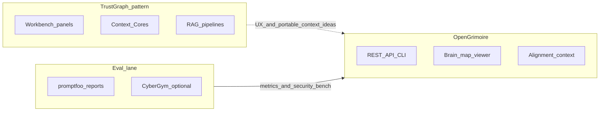

# External repos landscape (SCP-gated archive)

**Canonical detail:** The software repo brainstorm file holds the **full** alignment matrix, assimilation list, actionable paths table, plan critic JSON, process transparency, and diagram — same content as the originating plan, expanded with post-transcript notes:

`D:/software/docs/brainstorms/2026-03-23-external-repos-landscape-brainstorm.md`

This note summarizes sources, SCP, and vault-friendly excerpts so you are not dependent on chat history.

---

## Sources

| Source | URL |
|--------|-----|
| TrustGraph | https://github.com/trustgraph-ai/trustgraph |
| CyberGym | https://github.com/sunblaze-ucb/cybergym |
| GSD | https://github.com/gsd-build/get-shit-done |
| learn-claude-code | https://github.com/shareAI-lab/learn-claude-code |
| MoneyPrinterV2 | https://github.com/FujiwaraChoki/MoneyPrinterV2 |
| Maestro | https://github.com/mobile-dev-inc/Maestro |
| YouTube (context graphs / TrustGraph-style demo) | https://www.youtube.com/watch?v=sWc7mkhITIo |

---

## Full alignment matrix (same as plan + brainstorm)

| Source | Core idea | Fits your intent | Contrast / risk |
|--------|-----------|------------------|-----------------|
| [TrustGraph](https://github.com/trustgraph-ai/trustgraph) | Full “context platform”: Cassandra, Qdrant, Pulsar, RAG flows, **Workbench** (~8888), **Context Cores**, MCP | Context + retrieval + agents; Context Core = pin/version/rollback; workbench surfaces → OpenGrimoire GUI (operator clarity, inspectable graphs) | Not a drop-in: OpenGrimoire is **API/contract-first**; TrustGraph is **full infra**. Prefer **patterns/UX**, not fork-the-stack. |
| YouTube (`sWc7mkhITIo`) | *(Plan: unknown before transcript.)* | Tie to Workbench / context-graph UX after transcript | Captions + SCP + vault |
| [CyberGym](https://github.com/sunblaze-ucb/cybergym) | Agent security eval (vulns, PoC server, Docker) | Verifiable agent + security; complements **promptfoo**-style evals | ~240GB assets; **optional CI** or benchmark reference, not full vendoring |
| [get-shit-done](https://github.com/gsd-build/get-shit-done) | Spec-driven loop; `.planning/`; XML tasks | Matches OpenHarness phases, HANDOFF_FLOW, planning/qa-verifier, critic gates | Claude Code–centric vs repo **skills**; **bridge** via skill, not 40k-line duplicate |
| [learn-claude-code](https://github.com/shareAI-lab/learn-claude-code) | Teaching harness (loops, tools, subagents, skills) | Aligns with agent-native-architecture / “harness not intelligence” | Thin skill → s01–s12 + your patterns |
| [MoneyPrinterV2](https://github.com/FujiwaraChoki/MoneyPrinterV2) | Social/automation (Shorts, affiliate, etc.) | Low alignment unless you build growth automation | **AGPL-3.0**; ToS/ethics; **contrast only** |
| [Maestro](https://github.com/mobile-dev-inc/Maestro) | YAML mobile/web E2E | Already in OpenGrimoire: Playwright = CI truth; Maestro optional | More Maestro only where Playwright does not cover mobile |

---

## Diagram

---

## Design insight (YouTube, post-transcript)

The video demonstrates a **context graph** built from **London-area pubs, restaurants, and event spaces**, with **explanability**: show which graph relationships and source data support an answer to natural-language questions (e.g. where to drink craft beer, how broadening the question changes the subgraph). This supports the **TrustGraph Workbench** metaphor: inspectable graphs, grounding, and operator-visible sourcing — mapped to OpenGrimoire principles (read-only projections from API data, not a second truth store). See `GUI_WORKBENCH_PRINCIPLES.md` in OpenGrimoire docs.

---

## SCP outcome

- **Pipeline:** `run_pipeline(combined_text, sink="llm_context")` via local `scp` package (same contract as MCP `scp_run_pipeline`).
- **Dedupe (before re-archive):** Tag-stripped transcript, then iterative word-level dedupe (adjacent duplicate chunks + consecutive identical words + consecutive sentences). Typical shrink: ~14.4k → ~4.7k words on `sWc7mkhITIo`. Script: `D:/software/docs/research/dedupe_landscape_transcript.py` (set `AI_TRENDS_DATA` to your `ai_trends` dir).
- **Result:** `blocked: false`, **tier:** `hostile_ux`, **risk_score:** `0.0`. (Hostile UX tier = SCP registry matched casual language in the video; still not blocked for `llm_context`.)
- **Artifacts:** `D:/software/docs/research/repo_landscape_scp_run.json`
- **Note:** Full raw pull remains in `ai_trends` cache when `AI_TRENDS_DATA` is set.

---

## Assimilation (headline list; full bullets in brainstorm)

1. TrustGraph → OpenGrimoire GUI patterns (IA, Context Core metaphor) — **GUI_WORKBENCH_PRINCIPLES.md**
2. CyberGym + promptfoo — separate lanes; **EVAL_PROMPTFOO_CYBERGYM.md**; DECIDE-SIM plan in `software/.cursor/plans/`
3. GSD + learn-claude-code → **openharness** skills + **local-proto** README pointer
4. MoneyPrinterV2 — brief contrast only; AGPL boundary
5. Maestro — docs already source of truth; Playwright gate

---

## Open questions

- **Vault path:** `obsidian_cursor_integration` vs `Arc_Forge/ObsidianVault` — which is canonical for your daily notes?
- **TrustGraph:** UX-only vs read-only API spike?
- **CyberGym:** docs-only vs CI subset?
- **GSD:** global `npx` vs project-local install?

---

## Downstream docs

- Brainstorm (full matrix, critic JSON, transparency, actionable paths): `D:/software/docs/brainstorms/2026-03-23-external-repos-landscape-brainstorm.md`
- OpenGrimoire: `GUI_WORKBENCH_PRINCIPLES.md`, `EVAL_PROMPTFOO_CYBERGYM.md` under `OpenGrimoire/docs/`
- Skills: `openharness/.cursor/skills/gsd-workflow/`, `learn-claude-code-harness/`
