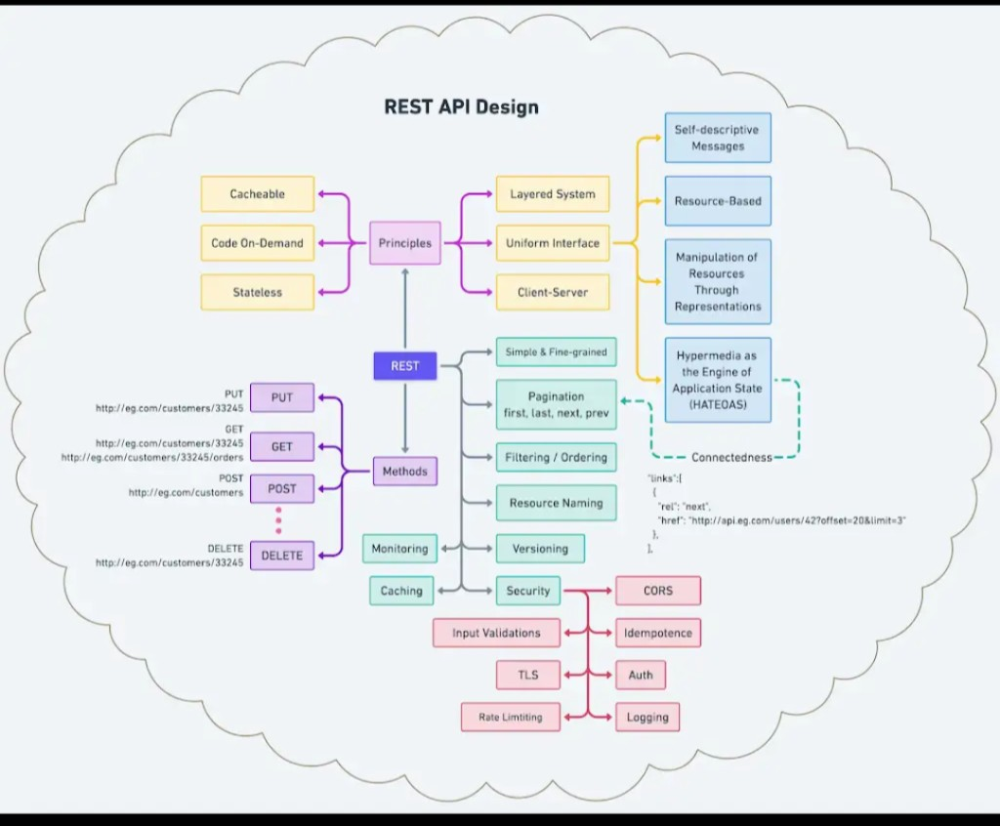
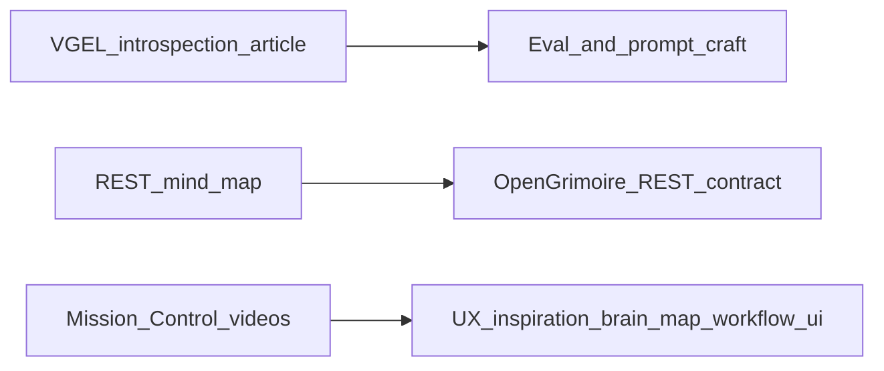

# Introspection article, REST map, Mission Control videos (archive)

Vault-friendly archive of four sources: interpretability article (VGEL), REST API design mind map (image), and two YouTube references (Mission Control / OpenClaw). Includes integration notes against OpenGrimoire, Arc_Forge workflow tooling, and harness safety — **not** an executable runbook.

---

## Sources

| Source | URL or location |
|--------|-----------------|
| Article — *Small Models Can Introspect, Too* | https://vgel.me/posts/qwen-introspection/ |
| Article — code | https://github.com/vgel/open-source-introspection |
| Image — REST API Design mind map | Embedded below; file: `research/assets/rest-api-design-mindmap.png` |
| Video A — Mission Control / productivity zone tour | https://youtu.be/AnwQ2uUq16c |
| Video B — Short (related) | https://youtube.com/shorts/heItW5VyD7Y |

---

## Article digest (VGEL / Qwen introspection)

- **Setup:** Steer Qwen2.5-Coder-32B during KV-cache prefill for early turns (“injection” via control vectors on selected layers, e.g. middle layers), then remove steering and continue generation; compare **logits** (e.g. next token after `"The answer is"`) between baseline and steered runs.
- **Finding:** Without extra prompting, “yes” vs “no” for “did you detect an injection?” shifts only slightly under steering — easy to miss with naive sampling.
- **Prompting:** A long auxiliary prompt (transformer/KV-cache introspection explainer + Anthropic paper abstract) **greatly** increases the logit shift toward “yes” when injection occurred; **inaccurate** location hints or **lorem ipsum** filler sharply reduce it — suggests sensitivity to **wording and truthful context**, not length alone.
- **Controls:** Steering does not broadly increase “yes” on factual questions that should always be answered “no” (Anthropic-style control list), arguing against a trivial global “yes” bias at tested strengths.
- **Layers:** Logit lens shows “yes” emerging relatively late in the stack; final layers suppress “yes” in multiple scenarios — hypothesis: competing circuits (sandbagging vs accurate conditional signal).
- **Content reporting:** Hard to extract injected concept tokens at high confidence; boosted tokens often injection-related (“concept”, “thought”) or confounded with long prompt text.
- **Emergent misalignment:** Model-contrast vector and insecure finetune show smaller but present detection shifts; controls similar to above.
- **Non-claim for product:** This is **interpretability research** (offline analysis, special access to weights/steering). It is **not** a recipe for shipping “activation introspection” in production HTTP APIs or trusting model self-reports for security.

---

## REST mind map (image)

**Provenance:** Exported from Cursor workspace assets; copied into this vault as `rest-api-design-mindmap.png` (original long filename under `.cursor/projects/.../assets/`).

**Topics covered (from diagram):** REST constraints (cacheable, stateless, layered system, uniform interface including HATEOAS with example `links` for pagination); HTTP methods with example URLs; implementation practices (pagination first/last/next/prev, filtering, naming, versioning); security (CORS, idempotence, auth, logging, validation, TLS, rate limiting); monitoring and caching.

**Mapping to OpenGrimoire:**

- Normative contract: [`../../../OpenGrimoire/docs/ARCHITECTURE_REST_CONTRACT.md`](../../../OpenGrimoire/docs/ARCHITECTURE_REST_CONTRACT.md) (strict public REST, entity × HTTP × auth matrix).
- Discovery: [`GET /api/capabilities`](../../../OpenGrimoire/src/app/api/capabilities/route.ts) — machine/human index; backlog includes partial OpenAPI (`GET /api/openapi.json` or static manifest) — see Arc_Forge plan `.cursor/plans/agent-native_follow-up_backlog_b3578a98.plan.md`.
- **HATEOAS / `links`:** Diagram shows `rel` + `href` for next page — **stretch** alignment if list endpoints gain cursor/offset pagination; today prioritize honest method/path/auth docs over hypermedia if not yet product-prioritized.
- **Monitoring / caching / rate limits:** Operational framing in [`../../../OpenGrimoire/docs/engineering/OPERATIONAL_TRADEOFFS.md`](../../../OpenGrimoire/docs/engineering/OPERATIONAL_TRADEOFFS.md); survey/login rate limits in app middleware — scale-out → shared store (e.g. Redis) per contract notes.

---

## Videos — captions and intent

### Video A — tour (long)

- **URL:** https://youtu.be/AnwQ2uUq16c
- **Caption (from author thread):** “Just shipped this a tour of my productivity zone.” **Mission Control** is described as a productivity “magic mirror”: think, reflect, and speak — and it **instantiates** that back as imagery. Includes a walk around the neighborhood. Tags: #OpenClaw #SystemDesign #MemoryArchitecture.

**Interpretation for our stack:** Product/UX inspiration — closed loop from **voice/thought/reflection → visual instantiation** and **spatial/neighborhood** framing. Bridges conceptually to **brain-map / context-atlas** (inspectable graph as mirror of state) and **workflow_ui** (operator-visible steps and outputs), without requiring OpenClaw as a dependency unless we explicitly integrate it later.

### Video B — Short

- **URL:** https://youtube.com/shorts/heItW5VyD7Y
- **Transcript / caption:** TBD (not captured in the originating thread). Add a bullet here if you pull captions or paste a summary.

---

## Integration matrix

| Source | Core idea | Fits our intent | Contrast / risk |
|--------|-----------|-----------------|-----------------|
| VGEL article | Small open models show **conditional** logit signals for “injection detected”; **prompting** and **accurate** task framing dominate effect sizes | **Process** parallel: audit prompts, capability hints, and clarification wording materially affect reliability — invest in **precise operator/agent copy** | No production “read my activations” API; do not use model **self-report** as security ground truth |
| REST mind map | Checklist: principles, verbs, pagination, filtering, security, monitoring, caching | Reinforces OpenGrimoire **contract-first** work: entity matrix, capabilities, optional OpenAPI, HATEOAS as future enhancement | Avoid scope creep: hypermedia only when list APIs and clients need it |
| Video A (Mission Control) | Ambient **mirror** UI: speech/thought → visual feedback; system-design + memory narrative | Inspiration for **context-atlas** and **workflow** surfaces that **reflect** alignment/clarification/brain-map state to operators | Not a spec; implementation is separate (accessibility, privacy, cost) |
| Video B (Short) | *(TBD after transcript)* | Short-form companion to same theme | Capture captions when available |

---

## Schematic (not architecture truth)

---

## Harness / safety note

Interpretability results support **skepticism** toward claims like “I know whether I was manipulated” in conversational settings. For agent pipelines, keep **secure-contain-protect** and **handoff** discipline; treat clarification and alignment APIs as **data contracts**, not introspection oracles.

---

## Related internal pointers

- OpenHarness bridge (clarification polling): `OpenHarness/docs/OPENGRIMOIRE_CLARIFICATION_BRIDGE.md` (sibling repo).
- Arc_Forge workflow UI: `ObsidianVault/workflow_ui/`.
- Agent-native backlog : `.cursor/plans/agent-native_follow-up_backlog_b3578a98.plan.md` in this repo.
- **Phase A discovery gate (implemented):** OpenGrimoire [`docs/engineering/DISCOVERY_STABILITY_GATE.md`](../../../OpenGrimoire/docs/engineering/DISCOVERY_STABILITY_GATE.md) — `npm run verify:openapi` + capabilities + route index; admin **API discovery (mirror)** on `/admin`.
