# Feature Dependency Graph

## Purpose
Visual representation of feature dependencies, critical paths, and implementation order to guide development sequencing.

---

## Dependency Graph

```mermaid
flowchart TD
    subgraph Phase1["Phase 1: Foundation"]
        OCR[OCR Integration]
        RESTAPI[REST API]
        EVENT[Event-Driven Processing]
        PERF[Performance Optimization]
        BATCH[Batch Endpoints]
        PROG[Progress Indicators]
        ERR[Error Recovery]
    end
    
    subgraph Phase2["Phase 2: Intelligence"]
        AI[AI Summarization]
        TABLE[Table Extraction]
        ENTITY[Auto-Entity Extraction]
        META[Auto-Metadata Extraction]
        LAYOUT[Multi-Column Layout]
        CITATION[Citation Extraction]
        QA[Q&A Interface]
        KEY[Key Point Extraction]
        WEBHOOK[Webhook Triggers]
        FORMULA[Formula Preservation]
    end
    
    subgraph Phase3["Phase 3: Integration"]
        PDFPLUS[PDF++ Annotation Sync]
        ZOTERO[Zotero Integration]
        TAGGING[Auto-Tagging]
        BIDIR[Bidirectional Links]
        RICH[Rich Annotations]
        PLUGIN[Obsidian Plugin]
        BIBTEX[BibTeX Export]
        TOPIC[Topic Modeling]
        EXTAPI[External Tool APIs]
    end
    
    subgraph Phase4["Phase 4: Enhancement"]
        EXPORT[Export Formats]
        CROSS[Cross-Platform]
        VERSION[Versioning & Sync]
        SHAPE[Shape Annotations]
    end
    
    %% Phase 1 dependencies
    RESTAPI --> BATCH
    RESTAPI --> WEBHOOK
    RESTAPI --> ZOTERO
    RESTAPI --> PLUGIN
    RESTAPI --> EXTAPI
    EVENT --> CROSS
    
    %% Phase 2 dependencies
    OCR --> LAYOUT
    OCR --> TABLE
    AI --> QA
    AI --> KEY
    META --> CITATION
    TABLE --> FORMULA
    
    %% Phase 3 dependencies
    PDFPLUS --> BIDIR
    PDFPLUS --> RICH
    RICH --> SHAPE
    ZOTERO --> BIBTEX
    TAGGING --> TOPIC
    
    %% Cross-phase dependencies
    RESTAPI -.-> WEBHOOK
    RESTAPI -.-> ZOTERO
    RESTAPI -.-> PLUGIN
    
    style OCR fill:#ff6b6b
    style RESTAPI fill:#ff6b6b
    style AI fill:#4ecdc4
    style TABLE fill:#4ecdc4
    style PDFPLUS fill:#95e1d3
    style ZOTERO fill:#95e1d3
```

---

## Critical Path Analysis

### Critical Path 1: API Foundation

**Path**: REST API → [Batch Endpoints, Webhook Triggers, Zotero Integration, Obsidian Plugin, External Tool APIs]

**Impact**: REST API blocks 5 features  
**Priority**: Very High  
**Recommendation**: Implement REST API first in Phase 1

### Critical Path 2: OCR Foundation

**Path**: OCR → Multi-Column Layout → Table Extraction

**Impact**: OCR enables layout detection and improves table extraction  
**Priority**: Very High  
**Recommendation**: Implement OCR early in Phase 1

### Critical Path 3: AI Foundation

**Path**: AI Summarization → [Q&A Interface, Key Point Extraction]

**Impact**: AI Summarization blocks 2 features  
**Priority**: High  
**Recommendation**: Implement AI Summarization early in Phase 2

### Critical Path 4: Annotation Foundation

**Path**: PDF++ Annotation Sync → [Bidirectional Links, Rich Annotations] → Shape Annotations

**Impact**: PDF++ Sync blocks 3 features  
**Priority**: High  
**Recommendation**: Implement PDF++ Sync early in Phase 3

### Critical Path 5: Metadata Foundation

**Path**: Auto-Metadata Extraction → Citation Extraction  
**Path**: Auto-Tagging → Topic Modeling

**Impact**: Metadata extraction enables citation extraction  
**Priority**: Medium  
**Recommendation**: Implement in Phase 2

---

## Dependency Matrix

| Feature | Depends On | Blocks | Critical Path |
|---------|------------|--------|---------------|
| OCR | None | Multi-Column Layout, Table Extraction | Yes |
| REST API | None | Batch, Webhook, Zotero, Plugin, External APIs | Yes |
| Multi-Column Layout | OCR | Table Extraction | Yes |
| Batch Endpoints | REST API | None | Yes |
| Webhook Triggers | REST API | None | Yes |
| Zotero Integration | REST API | BibTeX Export | Yes |
| Obsidian Plugin | REST API | None | Yes |
| AI Summarization | None | Q&A, Key Points | Yes |
| Q&A Interface | AI Summarization | None | Yes |
| Key Point Extraction | AI Summarization | None | Yes |
| PDF++ Annotation Sync | None | Bidirectional Links, Rich Annotations | Yes |
| Bidirectional Links | PDF++ Annotation Sync | None | Yes |
| Rich Annotations | PDF++ Annotation Sync | Shape Annotations | Yes |
| Auto-Metadata | None | Citation Extraction | Yes |
| Citation Extraction | Auto-Metadata | None | Yes |
| Auto-Tagging | None | Topic Modeling | Yes |
| Topic Modeling | Auto-Tagging | None | Yes |
| Cross-Platform | Event-Driven Processing | None | Yes |

---

## Implementation Order Recommendations

### Phase 1 Order

1. **REST API** (Week 1-5) - Critical path, blocks 5 features
2. **OCR Integration** (Week 1-4) - Critical path, enables workflows
3. **Event-Driven Processing** (Week 1-3) - UX improvement
4. **Performance Optimization** (Week 1-4) - Enables scale
5. **Batch Endpoints** (Week 5-6) - Depends on REST API
6. **Progress Indicators** (Week 1-2) - Low effort, high value
7. **Error Recovery** (Week 1-3) - Reliability

### Phase 2 Order

1. **AI Summarization** (Week 1-6) - Critical path, blocks 2 features
2. **Auto-Entity Extraction** (Week 1-7) - Major workflow improvement
3. **Table Extraction** (Week 1-6) - High value
4. **Auto-Metadata Extraction** (Week 1-4) - Enables citations
5. **Multi-Column Layout** (Week 2-4) - Depends on OCR
6. **Citation Extraction** (Week 4-6) - Depends on Auto-Metadata
7. **Q&A Interface** (Week 6-8) - Depends on AI Summarization
8. **Key Point Extraction** (Week 6-8) - Depends on AI Summarization
9. **Webhook Triggers** (Week 1-3) - Depends on REST API
10. **Formula Preservation** (Week 6-8) - Depends on Table Extraction

### Phase 3 Order

1. **PDF++ Annotation Sync** (Week 1-4) - Critical path, blocks 2 features
2. **Zotero Integration** (Week 1-4) - Depends on REST API
3. **Auto-Tagging** (Week 1-3) - Organization
4. **Bidirectional Links** (Week 4-6) - Depends on PDF++ Sync
5. **Rich Annotations** (Week 4-6) - Depends on PDF++ Sync
6. **Obsidian Plugin** (Week 1-6) - Depends on REST API
7. **BibTeX Export** (Week 4-6) - Depends on Zotero
8. **Topic Modeling** (Week 3-6) - Depends on Auto-Tagging
9. **External Tool APIs** (Week 1-3) - Depends on REST API

### Phase 4 Order

1. **Export Formats** (Week 1-2) - Low effort
2. **Cross-Platform** (Week 1-4) - Depends on Event-Driven
3. **Versioning & Sync** (Week 1-6) - Data safety
4. **Shape Annotations** (Week 1-4) - Depends on Rich Annotations

---

## Dependency Risk Assessment

### High Risk Dependencies

1. **REST API** - Blocks 5 features, must be completed early
2. **OCR** - Enables many workflows, critical for coverage
3. **AI Summarization** - Blocks 2 features, high complexity
4. **PDF++ Annotation Sync** - Blocks 2 features, depends on external plugin

### Medium Risk Dependencies

1. **Auto-Metadata** - Blocks citation extraction
2. **Auto-Tagging** - Blocks topic modeling
3. **Table Extraction** - Blocks formula preservation
4. **Event-Driven** - Blocks cross-platform

### Low Risk Dependencies

1. **Rich Annotations** - Blocks shape annotations (low priority)
2. **Zotero** - Blocks BibTeX (medium priority)
3. **Multi-Column Layout** - Enhances table extraction (not blocking)

---

## Parallelization Opportunities

### Can Be Developed in Parallel

**Phase 1**:
- REST API + OCR (independent)
- Event-Driven + Performance Optimization (independent)
- Progress Indicators + Error Recovery (independent)

**Phase 2**:
- AI Summarization + Table Extraction (independent)
- Auto-Entity + Auto-Metadata (independent)
- Q&A + Key Points (both depend on AI, but can be parallel after AI)

**Phase 3**:
- PDF++ Sync + Zotero Integration (independent)
- Auto-Tagging + External APIs (independent)
- Bidirectional Links + Rich Annotations (both depend on PDF++ Sync, parallel after)

---

## Critical Path Summary

### Longest Path (Critical Path)

**REST API** (5 weeks) → **Zotero Integration** (4 weeks) → **BibTeX Export** (2 weeks) = **11 weeks**

**Alternative Path**: **OCR** (4 weeks) → **Multi-Column Layout** (2 weeks) → **Table Extraction** (6 weeks) = **12 weeks**

**Longest Overall**: **AI Summarization** (6 weeks) → **Q&A Interface** (4 weeks) = **10 weeks** (but can be parallel with other Phase 2 work)

### Bottleneck Features

Features that block the most other features:

1. **REST API**: Blocks 5 features
2. **OCR**: Enables 2+ features
3. **AI Summarization**: Blocks 2 features
4. **PDF++ Annotation Sync**: Blocks 2 features

---

## Recommendations

### Immediate Actions

1. **Start with REST API**: Unblocks 5 features
2. **Start OCR in parallel**: Independent, high value
3. **Plan for dependencies**: Ensure critical path features completed early

### Risk Mitigation

1. **REST API**: Start early, complete before Phase 2
2. **OCR**: Proof of concept early to validate approach
3. **AI Summarization**: Validate LLM integration early
4. **PDF++ Sync**: Analyze cache structure early

---

**Document Status**: Complete  
**Visualization**: Mermaid diagram above  
**Next Document**: Feature Tracking System
