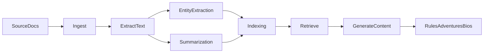

<!--
# PURPOSE: RAG integration guide for the Wrath and Glory knowledge stack.
# DEPENDENCIES: ObsidianVault scripts, campaign_kb search service.
# MODIFICATION NOTES: Initial integration blueprint with reuse-first mapping.
-->

# RAG Integration

## Goals
- Unify ingestion, retrieval, and generation into a single, consistent flow.
- Enable pattern analysis across factions, locations, NPCs, and missions.
- Support content generation for rules, adventures, and bios grounded in canon.

## Reuse vs. Create (source of truth)
- Ingestion (PDF + seed): `D:\Arc_Forge\ObsidianVault\scripts\ingest_pdfs.py`
- Summarization: `D:\Arc_Forge\ObsidianVault\scripts\ai_summarizer.py`
- Entity extraction: `D:\Arc_Forge\ObsidianVault\scripts\entity_extractor.py`
- Full-text retrieval: `D:\Arc_Forge\campaign_kb\app\search\service.py`
- Web API scaffolding: `D:\Arc_Forge\ObsidianVault\scripts\web_api.py`
- Orchestration (new): `D:\Arc_Forge\ObsidianVault\scripts\rag_pipeline.py`

## Data Sources and Ingestion
- Primary sources: seed docs, campaign docs, extracted PDF text.
- Ingestion outputs: Obsidian notes under `Sources/` and structured entities.
- Canon priority: seed docs, campaign docs, extracted PDFs, generated notes (in that order).

## Config vs campaign_kb ingest (important)

**Two separate configs drive different systems:**

| System | Config | What it drives |
|--------|--------|----------------|
| **RAG pipeline** | `ingest_config.json` → `rag_pipeline` section | Campaign docs from disk (`campaign_kb_root` + `campaign_docs`), PDF text from `pdf_extraction_dir`, retrieval path (KB search / ChromaDB / DocumentIndex) |
| **campaign_kb** | `campaign_kb` app.config (settings) | SQLite/Postgres Sections table populated by Daggr ingest workflow (PDFs, seeds, DoD, docs, repos) |

- **RAG pipeline** reads campaign docs directly from disk; it does *not* use `ingest_config.json` to populate the campaign_kb database.
- **campaign_kb search** (when `use_kb_search: true`) queries the Sections table. That table is populated by a **separate** ingest workflow (`python -m daggr_workflows.single_app ingest` or campaign_kb API).
- If the campaign_kb DB is empty, `retrieve_context` falls back to DocumentIndex or full text scan.
- To use KB search effectively, run campaign_kb ingest first. Use the **Campaign docs** node in the Daggr ingest workflow, or `POST /ingest/campaign-docs`. This ingests from `campaign_docs_root` (default: `campaign_kb/campaign`), which aligns with RAG's `campaign_docs`.

## Indexing and Retrieval
- Current retrieval: full-text search in `campaign_kb` (Sections table) when `use_kb_search` is true and DB is populated; otherwise DocumentIndex or full text scan.
- Optional vector layer: ChromaDB semantic retrieval; enable with `use_chroma: true`.
- Retrieval targets:
  - Sections for queries
  - Canon anchors for generation prompts

## ChromaDB semantic retrieval (Option B)

Optional semantic retrieval via ChromaDB + sentence-transformers. Enable with `use_chroma: true` in `ingest_config.json` under `rag_pipeline`.

**When to enable Chroma:**
- **Enable** when you want semantic search (meaning-based retrieval) over campaign docs and PDFs. Better for conceptual queries (e.g. "faith and corruption") and when keyword matches miss relevant content.
- **Leave disabled** (default) when keyword/theme retrieval is sufficient, or when you prefer minimal dependencies (no PyTorch/sentence-transformers). First run with Chroma enabled downloads the embedding model (~90MB for all-MiniLM-L6-v2).

**Install:**
```bash
cd ObsidianVault/scripts
pip install -r requirements-rag.txt
```
Note: sentence-transformers pulls PyTorch (~2GB). Use CPU-only if disk is constrained.

**Config** (in `ingest_config.json` → `rag_pipeline`):
- `use_chroma`: `true` to enable, `false` for legacy keyword retrieval (default).
- `chroma.persist_dir`: Path for ChromaDB persistence (default: `Campaigns/_rag_cache/chroma`).
- `chroma.embedding_model`: Model name (default: `all-MiniLM-L6-v2`).
- `chroma.collection_name`: Collection name (default: `arc_forge_rag`).

**First-run:** Index is built automatically when the pipeline runs with `use_chroma: true` and the collection is empty. Campaign docs and PDF text are chunked, embedded, and stored with chunk tags as metadata.

**Incremental updates:** Set `chroma.incremental: true` to add or update docs without full rebuild. When enabled and the collection already has data, the pipeline removes existing chunks for each doc in the current text_map and adds new chunks. This requires `doc_key` metadata on chunks (already present). Full rebuild remains the default (`chroma.incremental: false`) for simplicity and to avoid partial-state issues.

**Fallback:** If ChromaDB or sentence-transformers are not installed, the pipeline falls back to legacy keyword/DocumentIndex retrieval.

**Canon modes:** Strict, Loose, and Inspired By are preserved; metadata filters apply to ChromaDB queries.

**Hybrid retrieval:** Set `retrieval.strategy: "hybrid"` to combine ChromaDB semantic search with DocumentIndex keyword retrieval using Reciprocal Rank Fusion (RRF). Requires both `use_chroma: true` and a built DocumentIndex. Results from both retrievers are merged by source, scored with RRF (k=60), and deduplicated.

## Pattern Analysis Workflow
- Inputs: campaign docs + extracted PDFs.
- Outputs: entity counts, co-occurrence hints, theme tallies.
- Canon bias: prefer seed + campaign sources when scoring patterns.

## Storyboard Configuration

Storyboard generation uses config-driven campaign context and constraints. In `rag_pipeline` config, set `storyboard.campaign_context` (list of strings) and `storyboard.constraints` (list of strings) to customize the storyboard prompt. Defaults match Rogue Trader / Carcharodon Astra content. Override in `ingest_config.json` under `rag_pipeline.storyboard`.

## Content Generation Workflow
- Inputs: context summary + top entities + user prompt.
- Outputs: rules, adventure arcs, bios, rumors.
- Guardrails:
  - Must cite canonical sources when possible.
  - Flag speculative details explicitly.

## Prompt Templates (base)
**Rules Draft Prompt**
```
Use only the provided context. Draft a concise rules module with:
- Scope
- Mechanics
- Example of play
Context:
{context}
```

**Adventure Seed Prompt**
```
Generate a 3-act adventure outline grounded in the context.
Include: hook, key scenes, adversaries, and fallout.
Context:
{context}
```

**Bio Pack Prompt**
```
Generate 3 NPC bios tied to the factions/locations provided.
Each bio: role, motivation, secret, hook.
Context:
{context}
```

## RAG Metadata Schema (doc-level)
- RAG_Link: `campaign/05_rag_integration.md`
- RAG_Entity_Types: NPC, Faction, Location, Item, Theme
- RAG_Pattern_Targets: fields that should be mined for patterns
- RAG_Generation_Targets: outputs that should be generated from this doc
- RAG_Source_Priority: ordered list of canonical sources

## Chunk metadata schema (chunk-level)

Per-chunk tags for targeted retrieval. Keys match the schema below; values are strings (or empty).

| Field | Description | Allowed values / examples |
|-------|--------------|---------------------------|
| **System** | Game system or source book | `W&G`, `D&D`, `generic` |
| **Faction** | Faction or faction-adjacent | e.g. `Inquisition`, `Smugglers`, (empty) |
| **Location** | Place or region | e.g. `Footfall`, `void`, (empty) |
| **Time_period** | Era or time frame | e.g. `current`, `historical`, (empty) |
| **Mechanical_vs_narrative** | Content type | `mechanical`, `narrative`, or empty |
| **Tone** | Tone tag for matching | `grimdark`, `heroic`, `absurd`, `neutral`, or empty |

Ingestion (B2) stores these per chunk in the document index. Omitted keys are treated as unrestricted for filtering.

## Retrieval modes

DM-facing modes for how strictly to match chunk tags. Selectable when calling the retrieval API (e.g. `run_pipeline(..., retrieval_mode="Loose Canon")`).

| Mode | Meaning | Filtering / ranking |
|------|---------|--------------------|
| **Strict Canon** | Only chunks whose tags match the request (or configured tag_filters). | Include only entries where tags satisfy all requested filters; no tag = not included unless filter is optional. |
| **Loose Canon** | Chunks that match or are adjacent/similar in tag space. | Include chunks with overlapping or related tags; apply score boost for exact tag match, lower boost for adjacent. |
| **Inspired By** | Thematic similarity only; tag match optional. | Do not filter by tags; rank by existing keyword/theme/preview similarity. Use when DM wants mood or theme over strict canon. |

Implementation: retrieval accepts `retrieval_mode` (B3); filter/rank behavior is implemented in `DocumentIndex.retrieve()` and `retrieve_context()`.

## Implementation (chunk tags and retrieval)

- **Ingestion (B2):** Chunk tags are stored per document key in `Campaigns/_rag_cache/document_index.json` as an optional `"tags"` dict on each index entry. Keys: `system`, `faction`, `location`, `time_period`, `mechanical_vs_narrative`, `tone` (lowercase per schema above). Omitted keys are treated as unrestricted for filtering. Re-ingest updates index and tags.
- **Retrieval (B3):** The retrieval API accepts `retrieval_mode` (`Strict Canon` | `Loose Canon` | `Inspired By`) and optional `tag_filters`; behavior is documented in the "Retrieval API" subsection below.

## Retrieval API

- **How to pass retrieval_mode:** Call `run_pipeline(config_path, query=..., retrieval_mode="Loose Canon")` or pass `retrieval_mode` into `retrieve_context()`. Default can be set in config under `rag_config["query_mode"]["retrieval_mode"]`.
- **Behavior per mode:** See "Retrieval modes" above. Strict = filter to tag-matched chunks only; Loose = include adjacent/similar tags with scoring; Inspired = no tag filter, rank by text similarity only.
- **Optional tag_filters:** When using Strict or Loose, callers can pass a dict of requested tag values (e.g. `{"system": "W&G", "tone": "grimdark"}`). Omitted keys are unrestricted.

## Evaluation (minimum viable)
- Coherence (1-5): internal consistency and tone fit.
- Citation density (1-5): references to canonical sources.
- Canon reuse (1-5): overlap with seed/campaign docs.
- See `campaign/06_rag_evaluation.md` for scoring templates.

## Pipeline Overview

